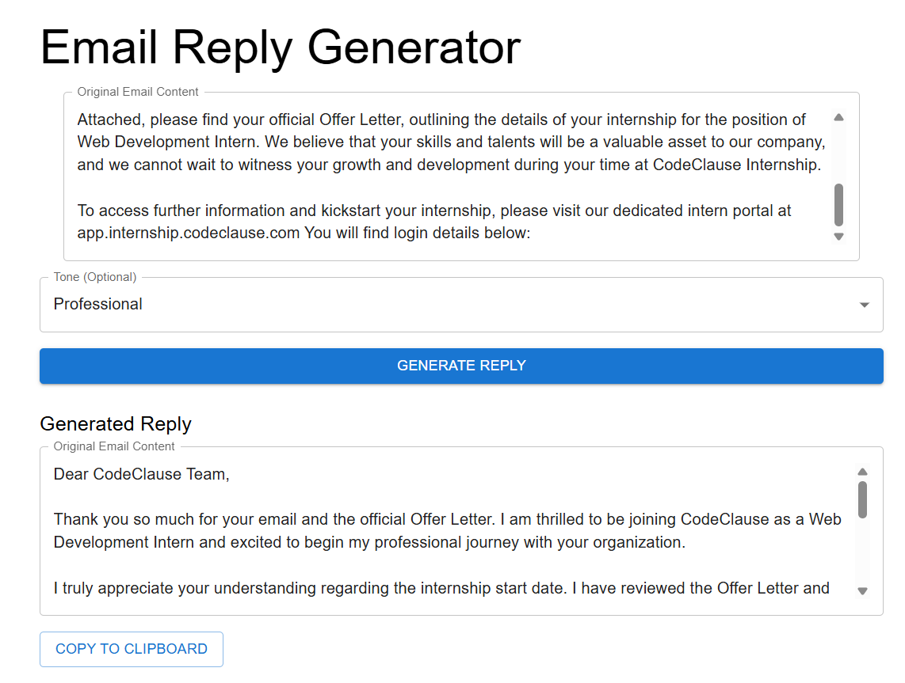

# Email Writer AI – Frontend (React)

A simple and sleek frontend built with **Vite + React**, using **Material UI** and **Axios**, that interacts with the Gemini AI-powered email reply generator backend.

## 📸 Screenshot

<p align="center">
  
</p>


## 🚀 Features

- Built using **Vite React** for lightning-fast performance
- Uses **Material UI** for modern and responsive UI components
- Communicates with backend via **Axios**
- Simple form-based input to get professional email replies using Gemini AI
- Clean folder structure and component-based design

## 📦 Tech Stack

- **React**
- **Vite**
- **Material UI**
- **Axios**

## 📡 API Integration

This frontend connects to the following backend API:

**POST** `http://localhost:8083/api/email/generate`

### Request Body

```json
{
  "emailContent": "Congratulations, you are selected for the CodSoft Internship Program. With great pleasure we would like to offer you the Internship Position at CodSoft.",
  "tone": "Professional"
}
```

### Response

```json
{
  "reply": "Thank you for the opportunity... [AI-generated reply]"
}
```

## 🛠️ Getting Started

### 1. Clone the repository

```bash
git clone https://github.com/raj121276thakre/email-writer-ai-frontend-React.git
cd email-writer-ai-frontend-React
```

### 2. Install dependencies

```bash
npm install
```

### 3. Start development server

```bash
npm run dev
```

App will be running at: [http://localhost:5173](http://localhost:5173)

## 📂 Project Structure

```
src/
├── App.jsx
└── ...
```

## 🤝 Connect Backend

Make sure your backend (`email-reply-writer-ai`) is running locally on port `8083`. If the API base URL is different, update it inside your Axios call.

---

Made with ❤️ by [Raj Thakre](https://github.com/raj121276thakre)
